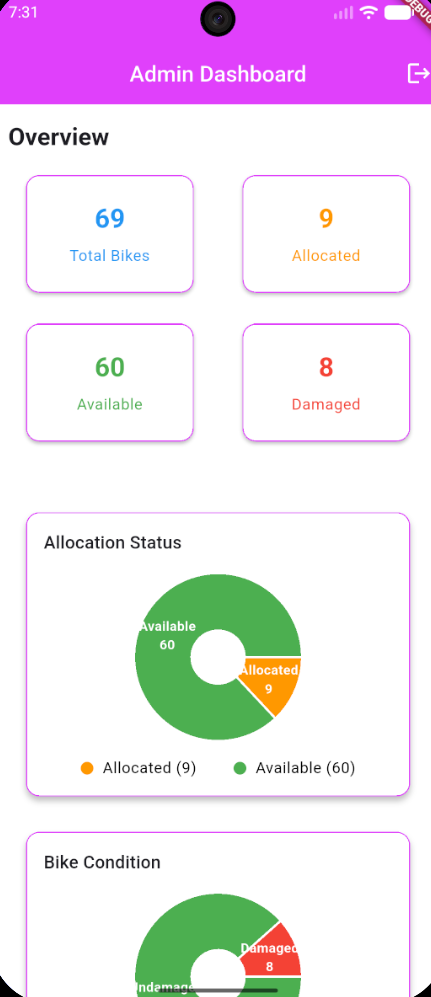
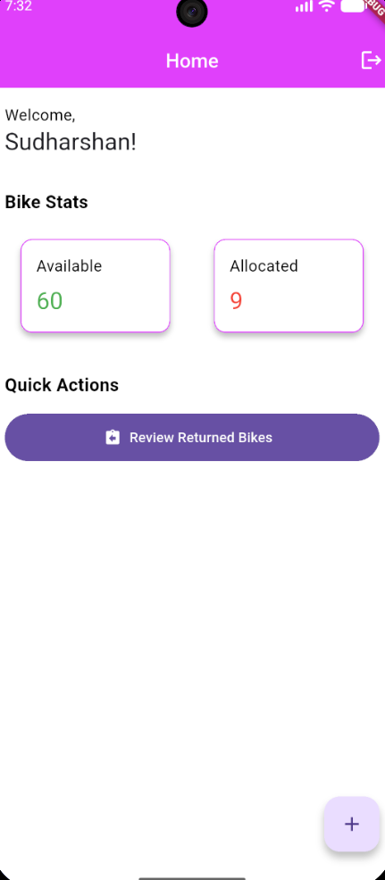
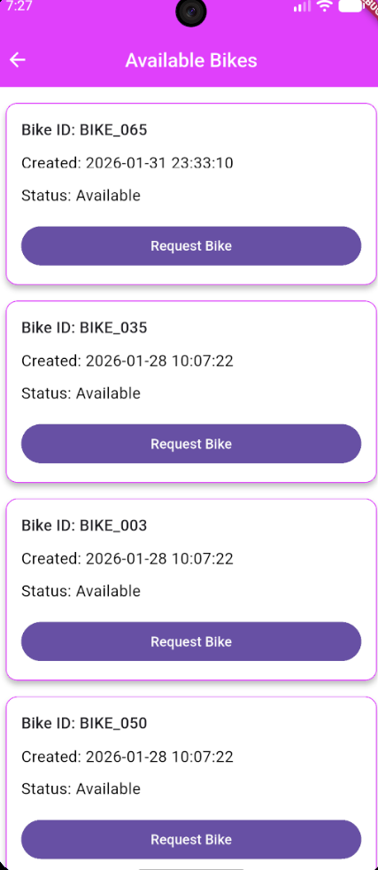

# Cyclot - Bike Management System

A Flutter-based bike management application designed for organizations to manage bike allocations, returns, and inventory tracking. The app uses Firebase for authentication and data storage.

## Screenshots

<div style="display: flex; gap: 10px;">
  
  
  
   
</div>

## Features

### Authentication
- User registration (creates Employee users by default)
- Email/password login with Firebase Authentication
- Role-based navigation and access control

### Employee Portal
- **View Available Bikes** - Browse bikes that are available for allocation
- **Request Bike** - Allocate an available bike to yourself
- **Return Bike** - Return your currently allocated bike (pending security review)
- **Notification Inbox** - View notifications about bike return reviews

### Security Portal
- **Dashboard Overview** - View counts of available and allocated bikes
- **Add Bikes** - Add new bikes to the inventory
- **Review Returned Bikes** - Inspect returned bikes and mark as damaged/undamaged
- **View Allocations** - See which bikes are allocated and to whom
- **Push Notifications** - Automatically notify employees when their returned bike is reviewed

### Admin Dashboard
- **Statistics Overview** - View total bikes, allocated, available, damaged counts
- **Allocation Status Chart** - Visual representation of bike allocation status
- **Bike Condition Chart** - Visual representation of damaged vs undamaged bikes

## Tech Stack

- **Framework**: Flutter
- **Backend**: Firebase
  - Firebase Authentication
  - Cloud Firestore
- **Charts**: fl_chart
- **Animations**: Lottie

## Project Structure

```text
lib/
├── main.dart                 # App entry point & auth check
├── firebase_options.dart     # Firebase configuration
├── core/                     # Core utilities, network, and theme
├── models/                   # Data models
├── repositories/             # Data access layer
├── screens/                  # UI screens
├── services/                 # Business logic and external services
└── widgets/                  # Reusable UI components
```

## Architecture

The project follows a clean, layered architecture designed to separate concerns and ensure maintainability:

1. **Presentation Layer (`screens/`, `widgets/`)**: Flutter UI components handling user interaction and visual state. Dependencies are optionally injected to support unit and widget testing.
2. **Business Logic Layer (`services/`)**: Core application workflows (e.g., `AllocationService`, `AuthService`). These services orchestrate complex transactions to ensure data consistency, particularly for high-concurrency actions like bike allocations.
3. **Data Access Layer (`repositories/`)**: Classes responsible for abstracting the Firestore database queries, retrieving collections, and transforming snapshots into typed models.
4. **Data Models (`models/`)**: Strongly typed data classes with serialization logic (`fromFirestore`, `toFirestore`) ensuring robust typing across the app.

### Architecture Decisions
- **Fake vs Mock Data Layers**: We specifically utilize `fake_cloud_firestore` rather than manual sealed-class mocks to accurately simulate complex database scenarios, including `runTransaction` race-condition preventions.
- **Dependency Injection**: We use constructor dependency injection at the UI layer (Screens). This decouples views from their concrete implementations, massively improving testability and scalability.
- **Service Segregation**: Complex business workflows (like atomic allocations) are housed strictly within `services/` rather than UI widgets, ensuring strict adherence to the Single Responsibility Principle.

## Firestore Schema

The detailed collection and document structures are documented in [docs/firestore-schema.md](docs/firestore-schema.md).

## Requirements

- **Flutter**: 3.11.0 or higher
- **Dart**: 3.11.0 or higher
- **Firebase Project**: Active project with Email/Password authentication enabled
- **Firestore**: Database created with appropriate indexes and security rules

## Getting Started

1. Clone the repository
2. Ensure Flutter 3.12.0+ is installed: `flutter --version`
3. Run `flutter pub get` to install dependencies
4. Configure Firebase:
   - Create a Firebase project at https://console.firebase.google.com
   - Enable Authentication (Email/Password method)
   - Create a Firestore database
   - Run `flutterfire configure` and select your Firebase project
5. Apply Firestore security rules and create required indexes (see [docs/security-rules.md](docs/security-rules.md) for details)
6. Run the app: `flutter run`

## Known Limitations & Future Enhancements

While Cyclot provides robust core workflows, there are several limitations planned for future enhancement:
- **Search and Pagination**: High-volume queries currently load entirely. Pagination, sorting, and robust search capabilities for bikes and history logs are slated for upcoming releases.
- **Offline Support**: The app heavily relies on an active internet connection to communicate with Firestore. Caching and offline persistence mechanisms are currently limited.
- **Admin Management**: User role management (promoting an employee to security or admin) must currently be performed directly in the Firebase Console. In-app user management for admins is a planned enhancement.
- **Advanced Identity Verification**: QR code scanning for faster bike checkout and physical identity verification is not yet implemented.

## License

This project is licensed under the MIT License - see the LICENSE file for details.
